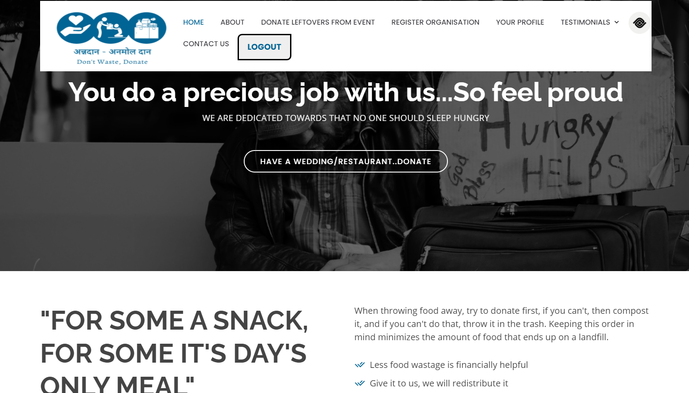
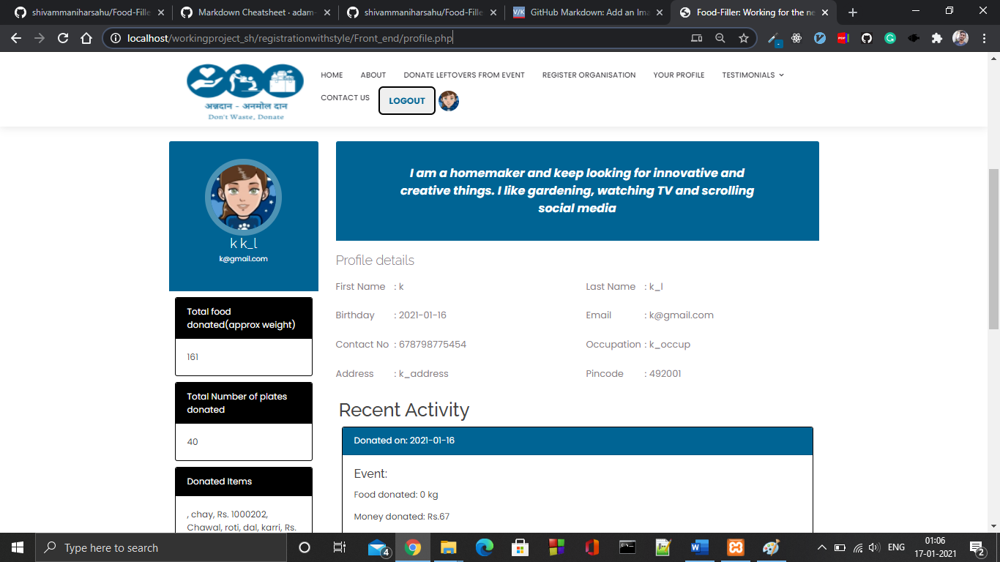

# Food-Filler 

Link for the Presentation- https://drive.google.com/file/d/1ioDceANvLVUy0mUqqyPx8-K0aFYczMr4/view?usp=sharing

Link for the Video- https://drive.google.com/file/d/1t1VNfS26kn37taGvv5xwAqSWxbJDR47B/view?usp=sharing

SERVICE TO MANKIND IS SERVICE TO GOD!! DON'T WASTE WHAT IS EDIBLE, DONATE!

An initiative for the the people who need food and can't afford it. We provide a plateform for the people who want to donate leftover food so that these food can reach to needy person and we can stop food wastage. Food donation is the utmost service of love and care you can show for the poor and needy. Our idea here is to present an web portal for online food donation where you can donate food without any hassle or issues. 

The website serves the functionality at two ends- at the end of the user, the user can donate, gain points and also look at what he has donated and has it reached the people required. On the other end, the NGOs can register themselves on our portal and can collect food from users and can serve the mankind as they already are doing. This is one of the first web portal where in everyone can track, donate and also get rewarded based on donations. The user will be able to get the NGO working nearby them, so they can be contacted for any issues.

We are currently working as a team Food-Filler and try to help community so that no one sleep empty stomach.

## Screenshot of website


 

## Features

1. Responsive and User friendly UI
2. Home page of Food Filler 
   * Useful links
   * Info about website.
   * Link to donate food
   * Link for login to personal account
   * SAVIOUR STORIES
   * Navbar containing Importent links to redirect to other pages.
3. About Page
   * Containing what functionalities we are providing
   * Number of events covered and donations.
4. Profile Page
   * One of the most functionality covered page.
   * > Profile Page
       >> * If user is login, redirect to profile page
       >> * If not login redirect to login page
       >> * If not registered yet, by clicking register button from login, redirect to register button.
   * Containing all profile information like name, mail, dob,email, address, contact etc. 
   * > Sidebar of profile page Conating 
       >> * total food donated
       >> * total money donated
       >> * Donated Items.
       >> * Earned total points for donated food
   * > Containing maximum 3 recent activity performed by user/doner
       >> * Date of donation
       >> * On which event he had donated food/money
       >> * Money donated
       >> * Total points earned for particular donation.
   * :grinning: Yeah! He can earn vouchers after a specific earned points which he can reedem on any nearby restaurants by clicking reedem button.   
   
   *    
5. DONATE LEFTOVERS FROM EVENT
   * This page is accessable only when user/doner is logged in.
   * > Here user/doner can donate  
       >> 1. Leftover food from any events or any food items.
       >> 2. Donar can donate money directly to his selected NGO's.
   * > After donate donar can will be redirected to profile page and he will find 
       >> * List of all NGO's which are registered in his own city.
       >> * Doner will select the NGO for his/her donated food, after select.
       >>> * Donar will get notification to his registered mail that particular NGO will collect the food.
       >>> * Select NGO will received notification for all the information of donar and donated items to receive donated items.
       
       
   * Here if user is login then he can directly donate food or money to his neareset choosed NGO's.
6. Testimonial-Leader Board
   * One of the most important page of website, it presents
     * > Represent the top 3 donars with their informations
     * > List of top 10 donars along with their earned points
   * A person can get motivote for the donation.
7. Contact Us
   * If any issue occure to any donar or NGO he can direcly submit his/her query to our team.
   * Can find other info related to food-filler.   
8. REGISTER ORGANISATION
   * Here an NGO can register itself.
   * Get a list of NGO currently registered on website 
9. Testimonial-Listen from users
   >
   >> * A donar can only submit testimonial only when he will be logged in.
   >> * A person who in not logged in, can see testimonials written by, written date.
   >> * Donar can give/write testimonial and it will be get published on portal in real time.   
10. :arrow_forward::arrow_forward::arrow_forward:Many more soon...   

---

## Technology stacks used in project: Web Technology
*  Frontend
   * HTML
   * CSS
   * JS
   * Bootstrap
*  Tools
   * Git
   * Github
   * Php
   * Php MyAdmin
*  Backend
   * Apache Server
   * MySql
*  Execution of project
   * Apache Server, using XAMPP
   
## Instruction to USE web application

*  Download the zip file or clone this repo using following command
   
     ``` bash
         git clone https://github.com/shivammaniharsahu/Food-Filler.git
     ```
*  Install XAMPP to run server by this link
     ``` bash
         https://www.apachefriends.org/download.html
     ```    
         
*  Go to directory C:\xampp\htdocs\
     ``` bash
         Paste here cloned project(Unzipped File) 
     ```
*  Import SQL file into phpMyAdmin (registration.sql)

*  Run XAMPP server by opening XAMPP application
     ``` bash
         Run Apache molule.
         For Php MyAdmin run MySQL server. 
     ```     
*  Run the project on local server by this link
     ``` bash
         http://localhost/Food-Filler/Front_end/landing.php
     ```  
*  Hurrey! 😎, Our project running on localhost  

## Php MyAdmin

*  Added food-filler DB, where we can find created db in our project.

## Backbones of project(Contributors)

>| S.No.         | Name                  | Work Field                                   | Github Account                            |
>| ------------- |:---------------------:|:--------------------------------------------:|:-----------------------------------------:| 
>| 1             | Shivam Manihar Sahu   | Manage Databases- Worked on sql queries      |  https://github.com/shivammaniharsahu/    |
>| 2             | Shashwat Awasthi      | UI/UX design of Website, Worked on frontend  |  https://github.com/ShashwatAwasthi04     |
>| 3             | Rahul Singh Kushawaha | Worked on frontend of project,database work  |  https://github.com/Rahul-skush           | 
>| 4             | Ajay Kumar            | Worked on PHP backend, Query Processing      |  https://github.com/AJAYKR00KJ            |

---
     
     

    

   
   
